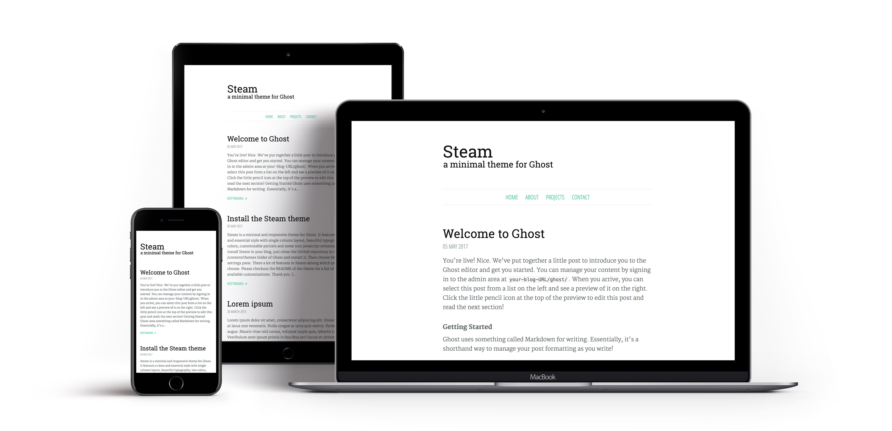

# Steam
[](https://github.com/epistrephein/Steam/releases/latest)
[](https://github.com/TryGhost/Ghost)
[](https://dev.epistrephe.in/steam)

[Steam](https://github.com/epistrephein/Steam) is a minimal and responsive theme for [Ghost](http://ghost.org/), forked from [Vapor](https://github.com/sethlilly/Vapor).

It features a clean and essential style with single column layout, beautiful typography, two colors, customizable partials and some nice javascript enhancements.

See a live demo of Steam [here](https://dev.epistrephe.in/steam).

[](https://dev.epistrephe.in/steam)

## Installation
Clone the repository in the `/content/themes` folder of Ghost or upload the latest release zip from the settings. Restart Ghost and choose Steam in the design pane.

    $ git clone https://github.com/epistrephein/Steam.git

## Customization

#### Choose a theme color
By default Steam uses a flat green theme color.
To switch to another theme color, first replace `{{> theme-green}}` with `{{!> theme-green}}` in `default.hbs`, then choose your desired color among those available: i.e. to activate the orange theme replace `{{!> theme-orange}}` with `{{> theme-orange}}`.

To use a custom color, replace instead `{{!> theme-customcolor}}` with `{{> theme-customcolor}}` and change the three occurrences of `#111111` and `#000000` in `partials/theme-customcolor.hbs` with the colors you prefer.

#### Customize the social icons
Change the given `a href` addresses in `partials/footer-social.hbs` or replace the icons with the ones you prefer using the [Font Awesome list](http://fortawesome.github.io/Font-Awesome/icons/), e.g. to add a Facebook icon add

    <a href="https://www.facebook.com/username" target="_blank" title="Facebook"><i class="fa fa-2x fa-fw fa-facebook"></i> <span class="hidden">Facebook</span></a>

If you don't want the social icons section, replace `{{> footer-social}}` with `{{!> footer-social}}` in `default.hbs`.

#### Customize the blog signature
Replace the text, email address and author name in the file `partials/footer-author.hbs`.
To remove it, replace `{{> footer-author}}` with `{{!> footer-author}}` in `default.hbs`.

#### Hide post author section
If you don't want to show the author section (which is profile picture, bio, website and location) at the bottom of posts, replace `{{> post-author}}` with `{{!> post-author}}` in `post.hbs`.

#### Activate the comments
Replace `{{!> comments-disqus}}` with `{{> comments-disqus}}`, `{{!> comments-facebook}}` with `{{> comments-facebook}}` or `{{!> comments-google-plus}}` with `{{> comments-google-plus}}` in the `post.hbs` file.

To enable Disqus comments, remember to add your actual Disqus ID in `partials/comments-disqus.hbs`.

#### Add Twitter, Google Webmaster and Facebook meta
Replace `{{!> meta}}` with `{{> meta}}` in `default.hbs`, then customize the content of `partials/meta.hbs`.

#### Activate Google Analytics
After you've created your Google Analytics account, change `{{!> google-analytics}}` to `{{> google-analytics}}` in `default.hbs`, ensuring to replace `YOUR_TRACKING_CODE` with your actual tracking code.

#### Custom favicon and apple-touch-icon
To customize the favicon and/or apple-touch-icon of your blog place your 16x16 `favicon.png` and 180x180 `appletouchicon.png` in `/assets/img/`.

#### JavaScript
##### Smooth Scroll
Steam features [Smooth Scroll](https://github.com/cferdinandi/smooth-scroll) for nice scrolling animations. The default settings are in `js/steam.js`

```javascript
smoothScroll.init({
    speed: 800,
    easing: 'easeInOutCubic',
    updateURL: false,
    offset: 125,
});
```

Smooth Scroll is automatically injected in footnotes refs and backrefs when created via their markdown syntax.

```md
This is the body of the post with a footnote ref[ˆ1] somewhere.

[^1]: End of the post with the footnote text.
```

##### highlight.js
Steam also features [highlight.js](https://highlightjs.org) for syntax highlighting: you can disable it by removing the line

```javascript
hljs.initHighlightingOnLoad();
```

in `js/steam.js`

You can force a code block into a specific language highlighting by appending the lang name, e.g.:

    ```ruby
    puts "Hello, World!"
    ```

If you want to suppress the highlighting for a particular code block, you can use `nohighlight`:

    ```nohighlight
    $ git clone https://github.com/epistrephein/Steam.git
    ```

## Contributing
Bug reports and pull requests are welcome on [GitHub](https://github.com/epistrephein/Steam).

This project is intended to be a safe, welcoming space for collaboration, and contributors are expected to adhere to the [Code of Conduct](CODE_OF_CONDUCT.md).

## License
This project is released under the terms of the MIT license. See [LICENSE](LICENSE) for further details.
